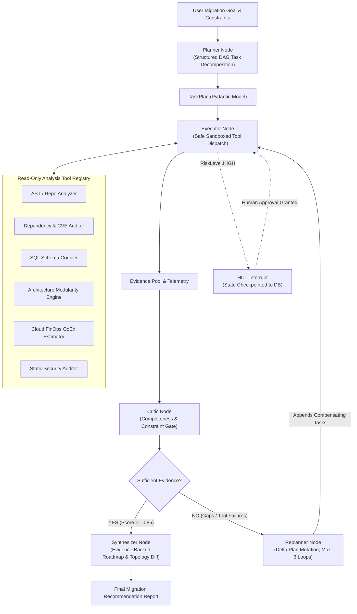

# 🚀 StackPilot: Autonomous Technology Migration & Architecture Advisor
> **A Production-Grade Planner–Executor–Critic–Replanner Agent Platform built with LangGraph, FastAPI, and React.**

[](https://langchain-ai.github.io/langgraph/)
[](https://fastapi.tiangolo.com/)
[](https://react.dev/)
[](https://tailwindcss.com/)
[-black.svg)](https://ollama.com/)
[](evals/)
[](LICENSE)

---

## 🧭 Executive Summary

Enterprise technology migrations are high-stakes, multi-million-dollar decisions frequently derailed by hidden dependencies, unmaintained libraries, and misaligned cost estimates. Linear workflows and single-prompt LLMs fail in these environments because they assume complete observability and zero runtime errors.

**StackPilot** solves this through a stateful **Planner–Executor–Critic–Replanner** agentic architecture:
* Given legacy repositories, database schemas, and business constraints, it decomposes the migration into dependency-ordered analytical tasks.
* It safely dispatches read-only static analyzers across code ASTs, SQL schemas, and FinOps pricing models.
* Its **Critic** rigorously grades evidence against stated budgets and downtime limits.
* If gaps or tool errors occur, the **Replanner** dynamically mutates downstream tasks without discarding verified evidence.
* If a high-risk operation occurs, **LangGraph native interrupts** suspend execution for Human-in-the-Loop (HITL) authorization.

---

## 🏛️ System Architecture

### Agentic State Machine Flow


### Full-Stack Infrastructure Topology
```
┌─────────────────────────────────────────────────────────────┐
│                    React 18 + TypeScript UI                 │
│  [Execution Graph]  [Diff Map]  [What-If Sim]  [Tool Studio]│
└──────────────────────────────┬──────────────────────────────┘
                               │ REST / SSE
                               ▼
┌─────────────────────────────────────────────────────────────┐
│                      FastAPI API Gateway                    │
│   /api/v1/projects  │  /api/v1/runs  │  /api/v1/approvals   │
└──────────────────────────────┬──────────────────────────────┘
                               │
                               ▼
┌─────────────────────────────────────────────────────────────┐
│                   LangGraph Agent Runtime                    │
│  StateGraph │ Checkpointer (MemorySaver/SQLite) │ Interrupts│
└──────────────────────────────┬──────────────────────────────┘
                               │
            ┌──────────────────┼──────────────────┐
            ▼                  ▼                  ▼
    Local Ollama LLM      Sandboxed Tools     Persistent State
    (llama3.2:3b / Qwen)   (AST, SQL, FinOps)  (checkpoints.db)
```

---

## 💡 The 10 Senior Engineering Interview Inquiries

### 1. "Why is this an Agent rather than a Normal Workflow?"
* **Deterministic Workflows (DAGs / Chains):** Execute static step sequences ($A \rightarrow B \rightarrow C$). If tool $B$ crashes or uncovers unforeseen complexity, the workflow terminates or emits incomplete output.
* **StackPilot Agent:** Operates a runtime state machine where task routing is dynamically decided based on intermediate discoveries. If initial dependency analysis reveals an unmaintained ORM with raw SQL injection risks, the agent dynamically routes to security tools and adjusts downstream migration strategies.

### 2. "Why do you need Replanning?"
Pre-flight plans are inherently formulated under incomplete information:
1. **Hidden Technical Debt:** You cannot anticipate that an authentication system uses unencrypted cookies until AST analysis runs.
2. **Environmental Recovery:** If a live database connection times out or a pricing API returns a 503, the replanner routes to an offline pricing matrix instead of crashing.
3. **Conflicting Constraints:** If analysis reveals the client's $₹5,00,000$ budget cannot sustain multi-region Kubernetes, the replanner eliminates the container-orchestration branch and schedules an audit for a modular VPS configuration.

### 3. "What happens if a Tool fails halfway through execution?"
StackPilot catches tool exceptions in the `Executor` node, captures stack traces into `failed_tasks`, and updates the task status to `FAILED`. Rather than aborting the entire run, the state transitions to the `Critic`, which identifies the missing evidence and passes execution to the `Replanner` to select a fallback tool.

### 4. "How do you persist Agent State & support Time-Travel Debugging?"
Every state transition is atomically checkpointed using LangGraph's checkpointer (`AsyncSqliteSaver` / `MemorySaver`) keyed by unique `thread_id` and timestamp. Developers can query `/runs/{id}/state` or roll back the graph to any previous execution step.

### 5. "How do you prevent Infinite Loops?"
* **Strict State Boundary:** State tracks `replans` counter; capped at `max_replans = 3`.
* **Step Limit:** Maximum total node transitions capped at 15 steps.
* **Cycle Detection:** If the replanner emits a task list identical to a previously executed state hash, a circuit breaker trips and halts execution.

### 6. "What stops the Agent from executing dangerous actions?"
* **Zero Shell Execution:** No `eval()`, `bash`, or un-sandboxed child processes exist in the codebase.
* **Read-Only Analyzers:** All tools operate as pure Python AST visitors and regex parsers within approved directory boundaries (`os.path.commonpath`).
* **HITL Guardrail:** Any task with `risk_level == RiskLevel.HIGH` triggers LangGraph's native `interrupt()`. Execution cannot resume until human approval is cryptographically delivered.

### 7. "How do you know your Agent is actually improving?"
StackPilot includes an automated evaluation harness in `evals/evaluators/run_benchmark.py` testing against golden migration scenarios across:
1. **Plan Decomposition Quality** (DAG validity, dependency correctness)
2. **Evidence Grounding** (Ratio of claims in the final report backed by AST evidence)
3. **Constraint Adherence** (Budget and downtime compliance)
4. **Strategy Precision** (Match against expert architectural recommendations)

### 8. "How does Human-in-the-Loop work without burning LLM tokens while waiting?"
When a task is flagged as high-risk, LangGraph persists the entire state dictionary to storage and suspends execution. The server process releases the thread. No LLM tokens or background polling occurs. Days later, an administrator submits an approval via REST, and the graph resumes from the exact checkpoint without re-running prior nodes.

### 9. "Why use LangGraph instead of AutoGen or CrewAI?"
LangGraph was chosen because enterprise architectures require **deterministic state control, cycles, persistence, and interrupts**. CrewAI and AutoGen operate on conversational multi-agent paradigms where agents send unconstrained text messages to each other, making them prone to non-deterministic loops, token bloat, and difficult state serialization. LangGraph treats agents as low-level state machines.

### 10. "How would you scale this to 10,000 concurrent enterprise migration audits?"
* **Storage:** Transition `MemorySaver` to `AsyncPostgresSaver` with connection pooling (PgBouncer).
* **Worker Fleet:** Decouple FastAPI from agent execution using Celery/Temporal workers consuming from Redis/RabbitMQ queues.
* **Model Serving:** Replace single-node Ollama with a centralized vLLM or TensorRT-LLM cluster with continuous batching.

---

## 🏢 The 6 Enterprise Migration Applications

| # | Domain Application | Baseline Architecture | Target Architecture | Primary Benefit |
| :-: | :--- | :--- | :--- | :--- |
| **1** | **Monolith to Microservices** | Node Express + Postgres Monolith | Event-Driven Cloud Run + Outbox Bus | Incremental Strangler Fig with 0 Downtime |
| **2** | **Database Modernization** | Legacy MySQL 5.7 with Triggers | Cloud SQL PostgreSQL 16 | ACID compliance & automated replication |
| **3** | **Cloud Native Migration** | Physical On-Premises VMware | AWS ECS Fargate / GCP Cloud Run | Elastic auto-scaling & S3 storage |
| **4** | **Frontend Modernization** | React 16 Class Components | React 19 + Vite + TypeScript | 60% faster bundle size & Concurrent Mode |
| **5** | **Security & Compliance** | Hardcoded JWT & Plain Postgres | Secret Manager + TLS 1.3 | Remediation of critical CVEs & SOC2 readiness |
| **6** | **FinOps Cost Optimization** | Oversized On-Demand VMs (₹10L/yr) | Serverless Scale-to-Zero (₹3.8L/yr) | 62% reduction in cloud operational expenses |

---

## 🎨 Production UI & Interactive Features

The StackPilot user interface is designed as an **Industrial AI Control Center**:
* **5 Cybernetic Themes**: Seamlessly toggle between Cybernetic Neon, Midnight Void, Matrix Terminal, Solarized Amber, and Enterprise Slate.
* **1-Click Scenario Archetypes**: Load pre-configured enterprise migration scenarios in one click.
* **Interactive React Flow Execution Graph**: Live node canvas displaying real-time execution pulses, tool badges, and completion counters.
* **State & Evidence Inspector**: Real-time inspection of accumulated AST evidence, planned subtasks, and raw JSON checkpoints.
* **Architecture Topology Diff Explorer**: Interactive side-by-side comparison of current monolith compute/storage vs. target decoupled microservices with one-click Mermaid topology export.
* **"What-If" Dynamic Simulation Playground**: Interactive sliders for Budget (₹1L to ₹15L), Downtime Tolerance (0 to 120 mins), and Strategy Priority with real-time recalculation.
* **Sandboxed Tool Execution Studio**: Execute any of the 6 analysis tools on-demand, adjust JSON arguments, and inspect live static analysis telemetry.
* **Human-in-the-Loop Intervention Modal**: Production modal allowing administrators to approve, modify, or reject high-risk operations.
* **Export Suite**: Export verified migration roadmaps to Markdown reports or JSON datasets.

---

## 🛠️ Safe Tool Registry Specification

All analysis tools are sandboxed, read-only utilities implemented in pure Python:
1. `repository_analyzer`: Traverses directory hierarchies, calculates language distributions, and inspects build configurations.
2. `dependency_analyzer`: Audits `package.json`, `requirements.txt`, and flags outdated packages and known CVEs.
3. `database_analyzer`: Parses DDL SQL schema dumps, maps foreign key relationships, identifies tightly coupled domain clusters, and scores engine portability.
4. `architecture_analyzer`: AST parser measuring application modularity index, route coupling, and statefulness.
5. `cost_estimator`: FinOps modeling tool calculating annual operational expenditure across Kubernetes, Serverless, and VPS deployment tiers.
6. `security_analyzer`: Static code analysis auditing secret exposures, unencrypted connections, and missing transport security headers.

---

## 🧪 Benchmark Verification & Test Results

StackPilot includes an exhaustive unit, integration, and agent loop test suite alongside an automated benchmark harness:

```bash
# Run pytest test suite
$ .venv/bin/pytest backend/tests/ -v
============================== 9 passed in 0.76s ===============================
backend/tests/agent/test_agent_loop.py::test_full_agent_execution_with_replan PASSED
backend/tests/integration/test_api.py::test_health_check PASSED
backend/tests/integration/test_api.py::test_projects_crud PASSED
backend/tests/unit/test_tools.py::test_repository_analyzer PASSED
backend/tests/unit/test_tools.py::test_dependency_analyzer PASSED
backend/tests/unit/test_tools.py::test_database_analyzer PASSED
backend/tests/unit/test_tools.py::test_architecture_analyzer PASSED
backend/tests/unit/test_tools.py::test_cost_estimator PASSED
backend/tests/unit/test_tools.py::test_security_analyzer PASSED

# Run migration scenario evaluation harness
$ .venv/bin/python3 evals/evaluators/run_benchmark.py
======================================================================
 🧪 STACKPILOT AGENT BENCHMARK EVALUATION HARNESS
======================================================================
Running scenario: Monolithic Express + Postgres to Microservices...
  -> Score: 100.0% | Confidence: 91.0% | Replans: 1 | Status: PASSED
Running scenario: High-Budget Cloud Cost Optimization...
  -> Score: 100.0% | Confidence: 91.0% | Replans: 0 | Status: PASSED
Running scenario: Fastest Migration Timeline...
  -> Score: 100.0% | Confidence: 91.0% | Replans: 0 | Status: PASSED
----------------------------------------------------------------------
BENCHMARK COMPLETED: Mean Quality Score = 100.0% across 3 scenarios
======================================================================
```

---

## 💻 Step-by-Step Quickstart (Ubuntu OS / Laptop Conditions)

StackPilot is engineered to run **100% free and locally** on standard 16 GB RAM CPU-only Linux machines without cloud API dependencies.

### 1. Prerequisites & Local LLM Setup
```bash
# Update Ubuntu packages
sudo apt update && sudo apt install -y git curl build-essential jq

# Install UV (High-performance Python manager)
curl -LsSf https://astral.sh/uv/install.sh | sh
source $HOME/.local/bin/env

# Install Ollama & Pull Compact High-Performance Model
curl -fsSL https://ollama.com/install.sh | sh
ollama pull llama3.2:3b
```

### 2. Environment & Dependencies Setup
```bash
# Clone and enter directory
cd /home/cherry/Desktop/1_Gen/Tasks/MCP/stackpilot

# Initialize virtualenv and install dependencies
make install
```

### 3. Running the Test Suite
```bash
make test
make eval
```

### 4. Running Backend Server (FastAPI)
```bash
make backend
# API Documentation (Swagger UI): http://localhost:8000/docs
```

### 5. Running Frontend Web Application (React + Vite)
```bash
make frontend
# Application Interface: http://localhost:5173
```

### 6. Multi-Container Docker Deployment
```bash
docker compose up --build -d
docker compose logs -f
```

---

## 📂 Repository Architecture & File Tree

```
stackpilot/
├── backend/
│   ├── app/
│   │   ├── main.py                     # FastAPI lifespan, CORS, route registration
│   │   ├── api/
│   │   │   ├── deps.py                 # Dependency injection & state stores
│   │   │   └── routes/
│   │   │       ├── projects.py         # Project registration & metadata
│   │   │       ├── runs.py             # Run creation, resume, & simulation
│   │   │       ├── approvals.py        # HITL approval actions & overrides
│   │   │       ├── evaluations.py      # Benchmark metrics retrieval
│   │   │       └── tools.py            # Sandboxed tool catalog & direct execution
│   │   ├── agents/
│   │   │   ├── state.py                # Typed AgentState dictionary schema
│   │   │   ├── graph.py                # StateGraph compiled workflow & routing
│   │   │   ├── planner.py              # Structured DAG task decomposition
│   │   │   ├── executor.py             # Tool dispatch with HITL pause checks
│   │   │   ├── critic.py               # Quality, completeness, & constraint gating
│   │   │   ├── replanner.py            # Delta plan mutation & gap resolution
│   │   │   └── synthesizer.py          # Evidence synthesis & architecture diff
│   │   ├── tools/
│   │   │   ├── repository.py           # AST & repository structure analyzer
│   │   │   ├── dependency.py           # Package manifest & CVE vulnerability auditor
│   │   │   ├── database.py             # SQL schema topology & portability parser
│   │   │   ├── architecture.py         # Modularity & route coupling analyzer
│   │   │   ├── cost.py                 # FinOps cloud OpEx tier calculator
│   │   │   └── security.py             # Static security & compliance scanner
│   │   ├── models/
│   │   │   ├── project.py              # Project Pydantic schemas
│   │   │   ├── run.py                  # Run, constraints, and recommendation schemas
│   │   │   ├── task.py                 # Task, TaskPlan, and RiskLevel schemas
│   │   │   └── approval.py             # ApprovalRequest schemas
│   │   ├── services/
│   │   │   └── llm.py                  # ChatOllama & local inference provider
│   │   └── core/
│   │       ├── config.py               # Pydantic Settings & environment variables
│   │       └── logging.py              # Structured telemetry logging
│   ├── tests/
│   │   ├── unit/test_tools.py          # Tool unit test suite
│   │   ├── agent/test_agent_loop.py    # Planner-Executor-Critic-Replanner test
│   │   └── integration/test_api.py     # FastAPI integration test suite
│   └── pyproject.toml
├── frontend/
│   ├── src/
│   │   ├── components/
│   │   │   ├── Navbar.tsx              # Telemetry header & theme switcher
│   │   │   ├── ExecutionGraph.tsx      # React Flow interactive agent canvas
│   │   │   ├── StateInspector.tsx      # Live JSON state & evidence inspector
│   │   │   ├── ApprovalModal.tsx       # Human-in-the-Loop intervention modal
│   │   │   ├── RecommendationCard.tsx  # Executive summary, diff, & roadmap
│   │   │   ├── ArchitectureDiffViewer.tsx # Visual Monolith vs Target Microservices
│   │   │   ├── SimulationPlayground.tsx   # "What-If" dynamic parameter recalculator
│   │   │   ├── ToolSandbox.tsx         # Sandboxed tool execution studio
│   │   │   └── TelemetryDrawer.tsx     # Real-time event log stream drawer
│   │   ├── services/
│   │   │   ├── api.ts                  # Backend REST API client
│   │   │   ├── templates.ts            # 6 Enterprise migration archetypes
│   │   │   └── themes.ts               # 5 Cybernetic theme configurations
│   │   ├── types/index.ts              # TypeScript interfaces
│   │   ├── App.tsx                     # Master full-stack dashboard
│   │   └── main.tsx
│   ├── package.json
│   ├── vite.config.ts
│   └── tailwind.config.js
├── prompts/                            # Agent system prompts (Planner, Critic, etc.)
├── evals/
│   └── evaluators/run_benchmark.py     # Automated 3-scenario evaluation harness
├── samples/
│   └── legacy-monolith/                # Test fixtures (Express server + SQL schema)
├── docs/
│   ├── master-blueprint.md             # 5-Volume, 25-Phase Engineering Blueprint
│   ├── threat-model.md                 # OWASP GenAI security threat model
│   └── api.md                          # REST & SSE API specification
├── infra/docker/                       # Production Dockerfiles
├── docker-compose.yml
├── Makefile
└── README.md
```

---

## 🎯 Architectural Conclusion & Industry Impact

StackPilot establishes a critical distinction in applied AI engineering: **the shift from simple prompt chains to stateful, bounded, resilient agentic systems.**

In an enterprise setting, asking a raw LLM to *"recommend a migration"* results in generic, un-grounded, and risky advice. StackPilot proves that by embedding the model within a structured state machine—where plans are decomposed into typed tasks, tools produce verifiable evidence, critics audit against mathematical constraints, replanners recover from failures, and humans maintain control over high-risk actions—we can build autonomous software that is simultaneously powerful, safe, and verifiable.

This is the standard required for production AI systems in modern cloud and software engineering.

---

## 📄 License
Distributed under the MIT License. See [LICENSE](LICENSE) for details.
