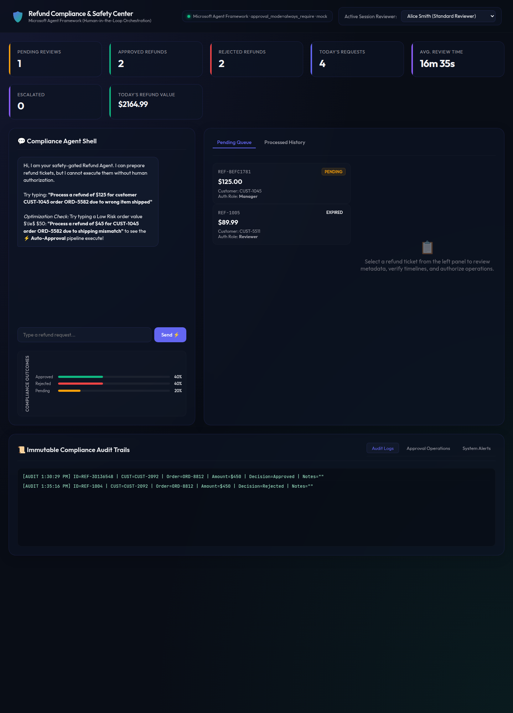

# 🛡️ Approval-Gated Refund Agent (Human-in-the-Loop)

> A secure AI-powered Refund Management System where the agent understands refund
> requests, verifies details, and prepares the refund — **but cannot execute it**
> without explicit human approval.

Built on the **Microsoft Agent Framework** tool-approval semantics
(`@tool(approval_mode="always_require")`), FastAPI, and a premium glassmorphism
DevUI. 100% free local stack (mock LLM by default; optional Groq/Ollama).


---

## 🎯 Aim

Financial, legal, and security-critical actions must **never** be executed
autonomously by an AI. This project demonstrates the single most important
enterprise AI-safety pattern: **Human-in-the-Loop approval for sensitive tools**.

## ✨ What it does

1. A customer/CSR submits a refund request in natural language.
2. The **AI Agent** parses it (regex fallback, or Groq/Ollama LLM), validates policy, and detects a sensitive tool.
3. The **approval gate** pauses the workflow, serializes a checkpoint, and raises a ticket.
4. A **human reviewer** approves / rejects / holds / escalates from the DevUI.
5. On approval the workflow **resumes**, the refund executes, an **audit record** is written, and **notifications** are generated.
6. Small, Low-risk refunds may pass an explicit **auto-approval** carve-out (configurable).

## 🧠 Key features

- **Real MAF integration** — the payment tool is registered with the official
  `agent-framework-core` `@tool(approval_mode="always_require")` decorator.
- **Workflow checkpointing** — pause & resume; single-spend tokens prevent double execution.
- **RBAC** — Standard Reviewer vs. Manager; high-value / high-risk refunds require Manager.
- **Anti-fraud** — duplicate active claims are blocked; double-approve is impossible.
- **SLA lease expiry** — pending tickets auto-expire and purge their checkpoints.
- **Audit trails** — append-only JSON-lines log (reviewer, role, IP, session, notes).
- **DevUI** — live stats, chat console, approval queue, customer risk profiler,
  decision form, execution timeline, notification inbox, live logs.
- **Configurable policy** — everything via `.env` (`MAX_AUTO_APPROVE_AMOUNT`,
  `MANAGER_LIMIT`, SLA timeout, rate limit, LLM provider).

## 🏛️ Architecture

```text
Customer → Refund Request → ChatAgent → Validate → Sensitive Refund Tool
   → [approval_mode="always_require"] → Checkpoint → DevUI
   → Approve/Reject → Execute/ Cancel → Audit Log → Notify Customer
```

See `docs/architecture.md` and `docs/workflow.md` for full diagrams and the
state-transition matrix, and **`docs/PROJECT_PLAN.md`** for the complete plan:
how to use, where to deploy, expectations, examples, milestones, acceptance
criteria, KPIs, and risks.

## 📁 Project structure

```text
approval-gated-refund-agent/
├── app/
│   ├── agent.py         # AI agent: LLM parser + heuristics, policy routing, checkpoints
│   ├── refund_tool.py   # sensitive payment tool (@tool approval_mode=always_require)
│   ├── approval.py      # decision handling, RBAC, SLA expiry, DB
│   ├── workflow.py      # checkpoint save/load/delete state machine
│   ├── settings.py      # centralized config (Phase 4.2)
│   ├── config.py        # backward-compatible re-exports
│   ├── models.py        # validated Pydantic schemas
│   ├── services.py      # stats + notification templates + outbox
│   ├── middleware.py    # per-IP rate limiting
│   └── utils.py         # logging + mock customer/order database
├── templates/dashboard.html   # DevUI
├── logs/                      # audit / approvals / errors logs
├── checkpoints/               # paused workflow state
├── tests/                     # 36 tests (unit + integration + API)
├── docs/                      # plan, architecture, workflow, security, testing, deployment, roadmap
├── Dockerfile · docker-compose.yml · Makefile
├── .env.example · requirements.txt
└── main.py                    # FastAPI app + REST API + UI
```

## 🚀 Quick start (100% free, offline)



```bash
python3 -m venv .venv && source .venv/bin/activate
pip install -r requirements.txt
python main.py                # DevUI → http://127.0.0.1:8000
```

Try in the chat console:

```text
Process a refund of $125 for customer CUST-1045 order ORD-5582 due to wrong item shipped
```

The ticket appears in **Pending Queue** (Manager sign-off required). Approve it as
**Bob Johnson (Manager)** to watch the refund execute, the timeline fill in, and the
customer email preview appear.

Also try a micro-refund to see auto-approval:

```text
Process a refund of $45 for CUST-1045 order ORD-5582 due to shipping mismatch
```

### Demo runner

```bash
python run_demo.py     # 6 scenarios: auto-approve, pause, duplicate, RBAC, resume, SLA expiry
```

## 📡 API

| Method | Endpoint | Purpose |
|---|---|---|
| `GET`  | `/api/health` | liveness + framework status |
| `GET`  | `/api/info` | active policy configuration |
| `GET`  | `/api/stats` | dashboard statistics |
| `GET`  | `/api/approvals` | all tickets |
| `GET`  | `/api/approvals/{id}` | ticket detail |
| `POST` | `/api/chat` | submit refund request |
| `POST` | `/api/approvals/{id}/decision` | Approve/Reject/Hold/Escalate/Req-info |
| `GET`  | `/api/notifications` | notification outbox |
| `GET`  | `/api/logs/{audit\|approvals\|errors}` | log feeds |
| `POST` | `/api/seed/reset` | re-seed demo data |

## 🔐 Security & compliance

Input validation, RBAC, rate limiting, env-var hygiene, audit logs, SLA leases,
and a global error handler — documented in `docs/security.md`.

## 🧪 Testing

```bash
python -m pytest -q        # 36 tests passing
```

Full test matrix in `docs/testing.md`.

## 🐳 Docker

```bash
docker compose up --build -d   # http://localhost:8000
```

See `docs/deployment.md` for local, Docker, and free-tier cloud deployment.

## 🗺️ Roadmap

See `docs/roadmap.md` for the learning path and the Phase 5.3 backlog
(PostgreSQL, Redis, Foundry memory, MCP, A2A, multi-agent review, real notifications).

## 📄 Final conclusion

Aim, uses, what/where/how, examples, applications, and the GitHub/socials portfolio
file: see **`docs/PORTFOLIO.md`**.
