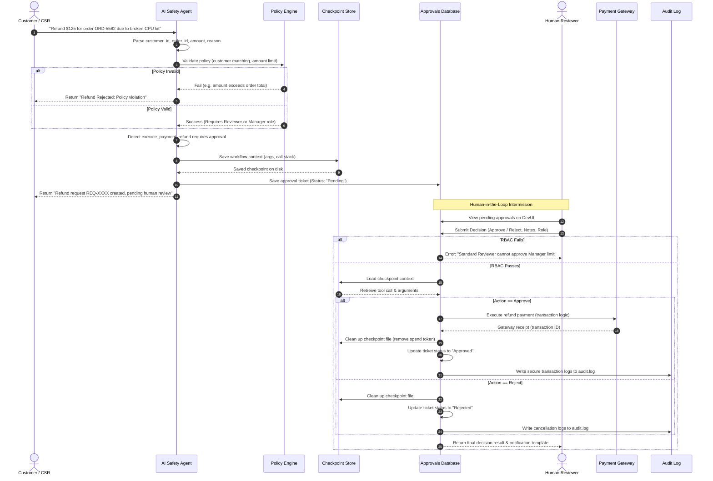

# 🔄 Approval-Gated Refund Agent Workflow Flow

This document details the step-by-step sequence of events for a refund transaction, including state transitions, checkpointing, and execution resumption.

## 🏃 Workflow Sequence Diagram

---

## 🚦 State Transition Matrix

The approval request transitions through the following lifecycle states:

| Source State | Trigger / Action | Target State | Checkpoint Action | Description |
|---|---|---|---|---|
| **None** | Customer Request | **Pending** | Saved | The request is verified, a refund tool call is prepared, and a checkpoint is written. |
| **Pending** | `Hold` by Reviewer | **Hold** | Maintained | The ticket is paused. Reviewer can write notes asking for more information. |
| **Pending** / **Hold** | `Escalate` by Reviewer | **Escalated** | Maintained | The required authorization role is upgraded from `Reviewer` to `Manager`. |
| **Pending** / **Escalated** | `Approve` by authorized Role | **Approved** | Deleted | The checkpoint is loaded, the payment executes, and the checkpoint is purged to prevent reuse. |
| **Pending** / **Escalated** | `Reject` by Reviewer | **Rejected** | Deleted | The transaction is cancelled, and the checkpoint is purged. |
| **Pending** | `Request More Info` | **Request More Info** | Maintained | The ticket remains active, waiting for client response. |
