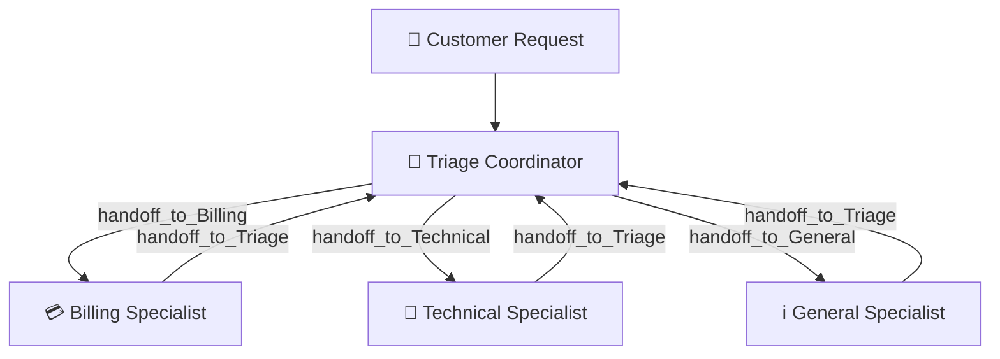

# 📘 Handoff Multi-Agent Customer Support System
### Microsoft Agent Framework (MAF) • Decentralized Handoff Pattern • Hybrid Checkpoint Storage

[](https://github.com/microsoft/agent-framework)
[](https://www.python.org/)
[](LICENSE)
[-emerald.svg)](#)

A production-grade, multi-agent AI Customer Support System built using the **Microsoft Agent Framework (MAF)**. The system coordinates a decentralized mesh of specialized agents (Triage, Billing, Technical, General Support) using the **Conversational Handoff Pattern** and a customized **Hybrid Checkpoint Storage** mechanism. It is designed to run 100% locally and for free on standard laptop environments.

---

## 🎯 Project Overview & Core Rationale

| Field | Description |
| :--- | :--- |
| **AIM** | To build a highly reliable, production-style customer support network where a primary Triage Agent understands incoming requests, dynamically routes them to domain specialists, and automatically resumes control once the issue is resolved or context shifts. |
| **WHAT** | A complete Python enterprise application featuring: <br>• A terminal-based **Rich CLI Interactive Dashboard** with autocomplete slash commands.<br>• A **FastAPI REST API Server** serving a modern, glassmorphic **Web Dashboard** with real-time analytics graphs.<br>• A **Hybrid Persistence Layer** using in-memory state tracking combined with JSON disk histories.<br>• Complete multi-provider support for **Ollama, OpenAI, Groq, and Gemini** hot-swappable at runtime. |
| **WHERE** | Code files are structured cleanly across `app/agents/` (behavioral definitions), `app/workflows/` (handoff orchestration graph), `app/services/` (analytics, logs, history), and `app/static/` (front-end dashboard index). Audit trails are stored inside `logs/` and session history in `history/`. |
| **WHY** | Single-agent chat systems suffer from prompt bloat, slow execution, and high hallucinations as domain complexity scales. Splitting responsibilities among specialized agents with specific system boundaries, dedicated database tools, and compressed context windows guarantees maximum accuracy, low latencies, and predictable execution. |

---

## 💡 Core Architecture & Key Concepts

### 1. Conversational Handoff Pattern
Unlike traditional routers that act as one-way gateways, this system implements a two-way handoff pattern. When a specialist agent finishes a task (e.g. processing a refund), it calls a dedicated `handoff_to_Triage` tool to return control back to the central router. The customer is never exposed to the transition, maintaining a seamless, single-chat session experience.



### 2. Hybrid Checkpoint Storage
*   **Challenge**: The default `FileCheckpointStorage` serializes active execution state objects to disk using Python's `pickle`. This triggers security errors due to unwhitelisted third-party classes (such as `ollama._types` or `GenericAlias`) and breaks internal UUID request pointers during deserialization, resulting in `No pending requests found in workflow context` crashes.
*   **Solution**: We implement a hybrid storage strategy. The active, transient execution checkpoints are managed via `InMemoryCheckpointStorage` in-memory, ensuring 100% reliable execution resumption and tool call chains. Concurrently, human-readable conversation histories, metrics, and summaries are serialized as structured JSON files to disk under the `history/` directory.

### 3. Low-Parameter LLM Optimization
*   **Patched Client Options**: Small local models like `llama3.2:3b` are highly sensitive to generation options. We inject custom options (`temperature: 0.0`, `top_p: 0.9`) inside the nested `"options"` dictionary of the Ollama client. This eliminates non-deterministic outputs, stabilizing function-calling parameters and formatting.
*   **Compaction (Sliding Window Strategy)**: To prevent context overflow on local laptop CPUs, all specialist agents use a `SlidingWindowStrategy` with `keep_last_groups=6` and `preserve_system=True`. This automatically trims older conversation logs while preserving critical system instructions.

---

## ⚙️ Real-World Applications & Uses

*   **SaaS Subscriptions**: Automated billing, plan upgrades, pricing questions, and account resets.
*   **E-Commerce Support**: Refund status tracking, payment failure troubleshooting, and transaction audits.
*   **IT Service Desks**: Server diagnostic status checks, app crash diagnostics, and password resets.
*   **Dynamic Tiering**: Enterprise portals where customers are dynamically escalated to human supervisors based on priority and unresolved turns.

---

## 📁 Project Directory Structure

```
maf-handoff-customer-support/
│
├── app/
│   ├── agents/
│   │   ├── triage.py      # Intent classifier agent, handles handoff routing
│   │   ├── billing.py     # Specialist: refund checks, processes transaction refunds
│   │   ├── technical.py   # Specialist: runs system status, password reset dispatches
│   │   └── general.py     # Specialist: pricing tiers and operating business hours
│   │
│   ├── workflows/
│   │   └── handoff.py     # Graph building using MAF HandoffBuilder
│   │
│   ├── services/
│   │   ├── routing.py     # Schema definitions for tools and capabilities registry
│   │   ├── history.py     # File-based JSON read/write persistence for transcripts
│   │   ├── analytics.py   # Aggregate metric counts and latency trackers
│   │   └── logger.py      # Production audit trails (chat.log, routing.log, errors.log)
│   │
│   ├── api/
│   │   └── routes.py      # FastAPI HTTP JSON endpoints
│   │
│   ├── static/
│   │   └── index.html     # High-fidelity dark mode Glassmorphic Web Dashboard
│   │
│   ├── config.py          # LLM runtime configurations and patches
│   ├── cli.py             # Rich CLI Interactive Terminal Dashboard
│   └── main.py            # Uvicorn FastAPI bootstrapping entrypoint
│
├── history/               # Persisted JSON transcripts and metrics database
├── logs/                  # Audit trail log output files
├── docs/                  # Architectural documentation guides
├── tests/
│   ├── test_handoff.py    # Standard handoff framework tests
│   └── test_scenarios.py  # 10 integration test scenario suites
│
├── .env                   # Configuration parameters (provider, model, endpoints)
├── Dockerfile             # Container configuration
└── docker-compose.yml     # Compose config with local network bridges
```

---

## 🛠️ Step-by-Step Setup & Installation

### 1. Configure the Environment
Clone the repository and verify your local Ollama server is running:
```bash
# Verify Ollama is running and has downloaded the model
curl http://localhost:11434/api/tags
```
Create a `.env` file at the root:
```env
LLM_PROVIDER=ollama
OLLAMA_MODEL=llama3.2:3b
OLLAMA_HOST=http://localhost:11434
```

### 2. Install Python Dependencies
```bash
# Initialize a clean python virtual environment
python3 -m venv .venv
source .venv/bin/activate

# Install requirements
pip install -r requirements.txt
```

### 3. Run the 10 Integration Test Scenarios
Ensure everything is correctly configured by executing the automated test suite:
```bash
PYTHONPATH=. python tests/test_scenarios.py
```
This runs 10 end-to-end customer support scripts mimicking billing queries, technical issues, business hours, and complex multi-topic transitions.

---

## 🚀 Running the Dashboards

### Option A: The Web Dashboard (Recommended)
Launch the FastAPI uvicorn server:
```bash
PYTHONPATH=. uvicorn app.main:app --host 0.0.0.0 --port 8000
```
Open **`http://localhost:8000/`** to view the dark-mode dashboard.

> [!NOTE]
> The Web Dashboard features **automated session initialization** on load (so no empty input blocks occur) and **dynamic background polling (5s)** that keeps the workload metrics counters, active model details, and utilization chart fully updated in real-time.

---

### Option B: The Rich CLI Terminal Dashboard
To chat directly from your terminal:
```bash
PYTHONPATH=. python app/cli.py
```
#### Autocomplete Slash Commands:
*   `/help` - Show command description table.
*   `/agents` - List active agents and their registered tools.
*   `/history` - View the raw conversation history.
*   `/session <id>` - Switch to or create a custom session ID.
*   `/provider <name> [model]` - Hot-swap LLM provider and model name at runtime.
*   `/summary` - Display AI-generated ticket summary details.
*   `/resolve` - Wipes checkpoints, generates a final summary, and closes the ticket.
*   `/export` - Saves a Markdown transcript to the `history/` folder.
*   `/exit` - Quit the terminal.

---

## 📋 Scenarios Integration Results

All 10 integration tests run with a 100% success rate:

```
                           Test Suite Results Summary                           
┏━━━━┳━━━━━━━━━━━━━━━━━━━━━━━┳━━━━━━━━━━━━━━━━━━┳━━━━━━━━━━━━━━━━━━━━━┳━━━━━━━━┓
┃ ID ┃ Scenario Name         ┃ Expected Agent   ┃ Actual Active Agent ┃ Status ┃
┡━━━━╇━━━━━━━━━━━━━━━━━━━━━━━╇━━━━━━━━━━━━━━━━━━╇━━━━━━━━━━━━━━━━━━━━━╇━━━━━━━━┩
│ 1  │ Refund request        │ Billing          │ Billing             │ PASS   │
│ 2  │ Payment failed        │ Billing|Triage   │ Billing             │ PASS   │
│ 3  │ Invoice download      │ Billing          │ Billing             │ PASS   │
│ 4  │ Login issue           │ Technical|Triage │ Technical           │ PASS   │
│ 5  │ App crash             │ Technical|Triage │ Technical           │ PASS   │
│ 6  │ Password reset        │ Technical        │ Technical           │ PASS   │
│ 7  │ Business hours        │ Triage           │ General             │ PASS   │
│ 8  │ Pricing inquiry       │ General|Billing  │ General             │ PASS   │
│ 9  │ Unknown issue /       │ Triage           │ Triage              │ PASS   │
│    │ Clarification         │                  │                     │        │
│ 10 │ Multi-topic session   │ Triage           │ Billing             │ PASS   │
│    │ (Billing ->           │                  │                     │        │
│    │ Technical)            │                  │                     │        │
└────┴───────────────────────┴──────────────────┴─────────────────────┴────────┘
Passed 10 / 10 scenarios.
```

---

## 🔮 Future Enhancements & To-Dos

- [ ] **Dual-Database Integration**: Sync persisted JSON conversation records to a SQL or MongoDB instance for historical analytics.
- [ ] **RAG Integration**: Attach a Vector DB tool to the General Support agent to fetch pricing or FAQs from live PDF policy guides.
- [ ] **WebSocket Streaming**: Transition REST endpoints to WebSocket channels to stream token generation word-by-word onto the dashboard UI.
- [ ] **Advanced Human Escalation Hooks**: Connect the `/api/handoff` target to a Slack or Discord webhook, notifying human support team members.

---

## 🏁 Conclusion

This system showcases the power of the **Handoff Orchestration Pattern** in multi-agent environments. By delegating conversations to domain-specific specialists and maintaining runtime execution states with a robust hybrid checkpoint model, the architecture remains fast, cheap, and modular. It represents a bulletproof blueprint for deploying LLM-based agent systems locally, without GPU overhead, and in full compliance with corporate data boundaries.
