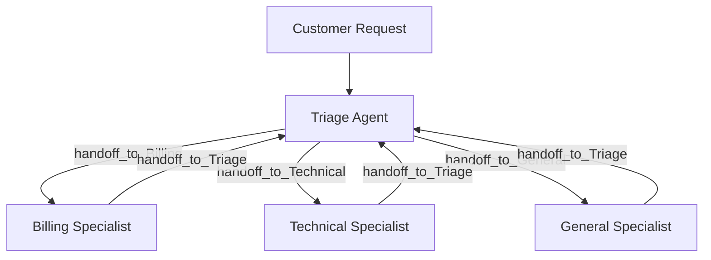

# AI Customer Support System - Architecture

This document describes the architectural layout, data flow, and pattern orchestration of the Microsoft Agent Framework (MAF) Customer Support Handoff system.

## 🏛 System Design Overview

Unlike traditional central-orchestrator chatbot loops, this system uses the **conversational handoff pattern**. In this decentralized mesh topology, agents communicate directly with one another by triggering specific handoff tools.

## 👥 Agent Definitions

1. **Triage Agent (`id="triage"`)**:
   - **Role**: Entrypoint dispatcher.
   - **Responsibilities**: Classifies user query intent, answers general greeting, routes specialized queries, and coordinates resolutions.
   - **Handoffs**: Routes to `Billing`, `Technical`, `General`.

2. **Billing Agent (`id="billing"`)**:
   - **Role**: Billing & Account Specialist.
   - **Responsibilities**: Checks refund status, processes virtual refunds, checks invoices.
   - **Tools**: `get_refund_status`, `process_virtual_refund`.
   - **Handoffs**: Returns to `Triage`.

3. **Technical Agent (`id="technical"`)**:
   - **Role**: Diagnostics & Troubleshooting Specialist.
   - **Responsibilities**: App crashes, database health checks, triggers password reset emails.
   - **Tools**: `check_server_status`, `send_password_reset_email`.
   - **Handoffs**: Returns to `Triage`.

4. **General Agent (`id="general"`)**:
   - **Role**: Office Information & Pricing Specialist.
   - **Responsibilities**: Working hours, basic plan details, office location.
   - **Tools**: `get_pricing_info`.
   - **Handoffs**: Returns to `Triage`.

## 💾 State Management & Checkpoints

The system implements stateless API boundaries by storing execution snapshots under `InMemoryCheckpointStorage`.

- **Supersteps**: The execution occurs in discrete supersteps. When an agent produces a response and requests user input, the framework halts and saves a checkpoint containing the in-flight conversation state.
- **Resumption**: When the customer replies, the API retrieves the checkpoint from storage using the `checkpoint_id`, satisfies the pending `request_info` event with the user message, and resumes the workflow.
