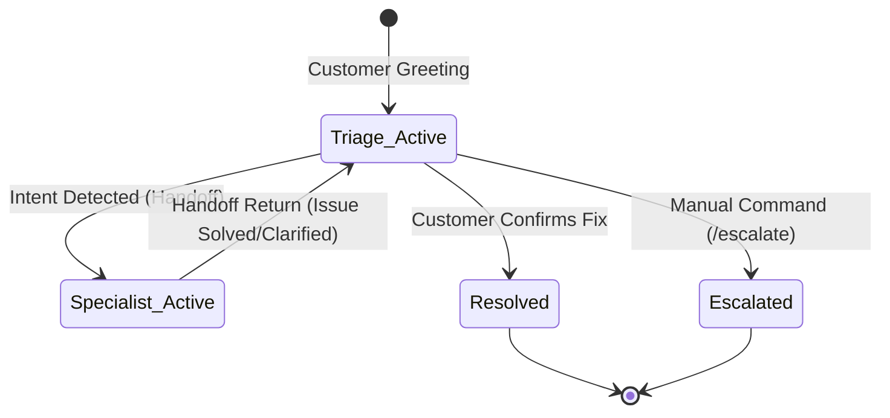

# Support Handoff Workflow & Ticket Lifecycle

This document describes the customer journey, ticket status transitions, and agent collaboration steps.

## 🔄 Ticket Lifecycle Flowchart

## 💬 Step-by-Step Transition Example

Below is a trace of the workflow logs during a transaction refund status lookup query:

### Turn 1: Intent Detection & Delegation
* **Customer input**: `"Hi, I need to check the status of my refund."`
* **Workflow Status**: Started under `Triage`.
* **Triage Decision**: Detects refund/billing intent. Invokes `handoff_to_Billing()` tool.
* **Control Flow**: Cloned Triage agent halts, hands execution control to `Billing` agent.
* **Billing response**: `"I've checked on that for you. Could you please provide me with the actual ticket ID so I can look up the status of your refund?"`
* **Workflow Status**: Yields `request_info` event and pauses execution, generating a checkpoint.

### Turn 2: specialist Tool Execution & Return
* **Customer input**: `"My refund ticket ID is TICKET-123"`
* **Workflow Status**: Restored from checkpoint. User response is fed into `Billing` agent.
* **Billing Decision**: Invokes `get_refund_status(ticket_id="TICKET-123")` tool.
* **Tool result**: `"Refund for ticket TICKET-123 was successfully processed on 2026-08-01 for $49.99."`
* **Billing response**: `"It looks like your refund has been successfully processed. The refund amount of $49.99 was issued on August 1, 2026. Is there anything else I can assist you with today?"`
* **Control Flow**: Billing specialist calls `handoff_to_Triage()` to transfer control back.
* **Workflow Status**: Control returns to `Triage`, yielding `request_info` for final user confirmation.
