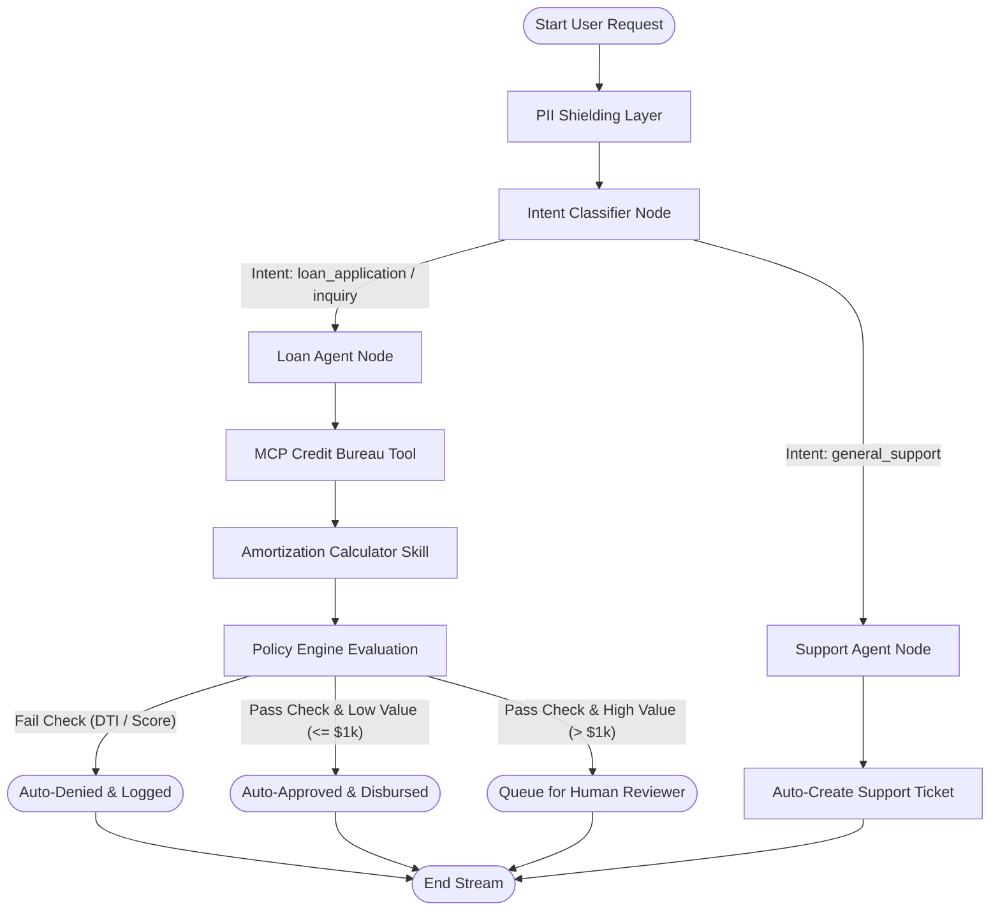

# 🏆 Governed Loan & Customer Support AI Platform

[](https://www.python.org/)
[](https://fastapi.tiapy.com)
[](https://github.com/langchain-ai/langgraph)
[](https://react.dev/)
[](https://tailwindcss.com)
[](https://sqlmodel.tiangolo.com/)
[](https://pytest.org)
[](https://www.docker.com)

> **Enterprise-Grade Regulated Banking Operations Platform, Powered by LangGraph Multi-Agent Workflows, PII Sanitizing Shields, and Strict Policy Guardrails.**

---

## 📌 Table of Contents
1. [💡 Platform Aim & Core Scope ("What")](#-1-platform-aim--core-scope-what)
2. [⚙️ Key Features & Operational Modules](#-2-key-features--operational-modules)
3. [📐 System Architecture & Workflow Engine](#-3-system-architecture--workflow-engine)
4. [📂 Repository Architecture ("Where")](#-4-repository-architecture-where)
5. [🚀 Startup & Local Execution Instructions ("How")](#-5-startup--local-execution-instructions-how)
6. [🐳 Deployment via Docker](#-6-deployment-via-docker)
7. [🛡️ Compliance, Governance & Safety Policies](#-7-compliance-governance--safety-policies)
8. [📝 End-to-End Execution Walkthroughs](#-8-end-to-end-execution-walkthroughs)
9. [🛠️ Future Roadmap](#-9-future-roadmap)

---

## 💡 1. Platform Aim & Core Scope ("What")

In highly regulated sectors like banking and finance, deploying AI agents requires absolute assurance of **safety, auditable governance, consumer privacy protection (GLBA/GDPR), and deterministic risk boundaries**.

This platform combines a **modern React (v19) + Vite + Tailwind CSS SPA** with a **FastAPI + SQLModel + SQLite + LangGraph** backend to build a fully compliant, self-auditing AI customer service and loan evaluation system.

### 🎯 Key Objectives:
*   **Zero Leakage of Sensitive Data:** Filter PII (SSN, credit cards, emails, phone numbers) *before* LLMs can consume or store them.
*   **Deterministic Guardrails:** Ensure AI cannot make autonomous loan decisions that violate bank policies (e.g., debt-to-income limits).
*   **Auditability & Inspection:** Retain cryptographic-quality ledger logs tracing every LLM response, intent classification, external API call, and manual override.
*   **Dual Engine Flexibility:** Dynamically fallback from advanced Gemini cloud models to local Ollama inference networks or smart rule engines to ensure uninterrupted offline capability.

---

## ⚙️ 2. Key Features & Operational Modules

The application is structured into **12 operational modules** accessible via the control panel:

| Module | Icon | Description |
| :--- | :---: | :--- |
| **Dashboard** | 📊 | Aggregated operational KPI panels, real-time ticket statuses, pending overrides, and compliance warning flags. |
| **Customer Directory** | 👥 | Database of customer bank profiles with credit scores, income metrics, and verified SSN records. |
| **Loan Operations** | 💳 | Interactive loan applications, APR amortization calculators, and real-time policy evaluations. |
| **Technical Support** | 💬 | Interactive conversational interface powered by LangGraph to process user requests or submit tickets. |
| **Agent Monitor** | 🔍 | Live visual LangGraph execution timeline, tracing active node traversal and state variables. |
| **Approvals Queue** | ⚖️ | Human-in-the-Loop review queue for high-value loans and compliance overrides. |
| **Compliance Center** | 🛡️ | Statistics on PII redactions, prompt sanitization logs, and risk policy toggle thresholds. |
| **Audit Trail** | 📜 | Chronological immutable log tracking all agent activities, system actions, and user logins. |
| **Knowledge Base** | 📖 | Structured documents explaining Standard Operating Procedures (SOPs) and banking guidelines. |
| **Analytics Engine** | 📈 | Graphs displaying application volume, approval ratios, and average agent response times. |
| **Model Configuration** | 🎛️ | LLM gateway dashboard to switch prompt pipelines between Gemini, Ollama, or Mock Fallbacks. |
| **System Settings** | ⚙️ | Global profile tokens, credentials management, and developer configuration options. |

---

## 📐 3. System Architecture & Workflow Engine

The backend workflow orchestrator is powered by **LangGraph**, representing conversation state as a directed graph. 

### LangGraph Workflows
The dialog execution maps to the following graph topology:



### Visual Interface Screenshots

#### 1. Core Analytics and Operations Dashboard

*Figure 1: Main banking dashboard display showcasing loan distributions, ticket volume tracking, and compliance metrics.*

#### 2. LangGraph Agent Monitoring & State Trace Inspector

*Figure 2: Real-time agent monitoring interface tracking intent parsing, node processing timeline, and LangGraph persistent memory values.*

---

## 📂 4. Repository Architecture ("Where")

The code is organized into a modular, feature-based project structure:

```
governed-loan-support-agent/
├── apps/
│   ├── api/                    # FastAPI ASGI Backend
│   │   ├── static/             # Target folder for built React production static assets
│   │   ├── routes/             # REST Routers
│   │   │   ├── auth.py         # Login, Registration & Customer Profile endpoints
│   │   │   ├── loans.py        # Loan creation, fetching, and actions
│   │   │   ├── tickets.py      # Customer support ticket operations
│   │   │   ├── approvals.py    # Compliance HITL approval gate overrides
│   │   │   ├── audit.py        # Log extraction for compliance officers
│   │   │   └── agents.py       # LangGraph Chat Orchestrator endpoint
│   │   ├── config.py           # Configuration manager and cryptography key variables
│   │   ├── database.py         # SQLModel database engine session provider
│   │   ├── dependencies.py     # Role-Based Access Control (RBAC) dependency checkers
│   │   └── main.py             # FastAPI entrypoint (mounts /static and includes routes)
│   └── web/                    # React SPA Frontend (Vite + TypeScript + Tailwind)
│       ├── src/
│       │   ├── types/          # Strict TypeScript model definitions
│       │   ├── context/        # AppContext (global states, API requests, user contexts)
│       │   ├── components/     # Reusable UI widgets (Navigation sidebar, Toasts, Skeletons)
│       │   ├── pages/          # 12 Operational views
│       │   ├── App.tsx         # Layout wrapper and routing state mapper
│       │   └── index.css       # Style sheets mapping colors for Light/Dark modes
│       ├── index.html          # SPA entrypoint
│       └── vite.config.ts      # Vite bundler configuration (with static base routes & proxy settings)
├── agents/                     # LangGraph Node Agents
│   ├── classifier.py           # User intent categorization node
│   ├── loan_agent.py           # Loan evaluation agent node (calculators & MCP hooks)
│   ├── support_agent.py        # Technical support agent node
│   └── llm_client.py           # LLM Dispatcher (Gemini API -> Local Ollama -> Mock Fallback)
├── policies/
│   └── policy_engine.py        # Automated DTI evaluations, score vetting, & self-dealing blocks
├── middleware/
│   ├── pii_shield.py           # Data masking regex shield layers
│   └── audit_middleware.py     # Request/Response auditing middleware
├── skills/
│   └── calculators.py          # Math logic for monthly payment amortizations
├── mcp/
│   └── credit_bureau.py        # Mock External Credit Bureau debt checking MCP tool
├── evaluation/
│   └── evaluator.py            # Latency, classification accuracy, & safety evaluator suite
├── scripts/
│   └── seed_db.py              # Mock database seeder script
├── docker/
│   ├── Dockerfile              # Multi-stage Docker image builder script
│   └── entrypoint.sh           # Container execution script hook
├── docker-compose.yml          # Persisted stack deploy definition
└── .github/workflows/ci.yml    # GitHub Actions Continuous Integration pipeline
```

---

## 🚀 5. Startup & Local Execution Instructions ("How")

Follow these steps to bootstrap and launch the backend and frontend services on an **Ubuntu Linux** or compatible shell:

### Prerequisites:
- Python 3.10+
- Node.js v18+ & npm
- Docker & Docker Compose (Optional)

### Step 1: Initialize Virtual Environment
Set up the Python context and install backend dependencies:
```bash
python3 -m venv .venv
source .venv/bin/activate
pip install -r requirements.txt
```

### Step 2: Configure Environment Variables
Copy `.env.example` to `.env` and fill in API keys if using external providers (e.g. Gemini):
```bash
cp .env.example .env
```
*Note: If no keys are provided, the platform automatically runs in smart mock/Ollama mode for local offline operations.*

### Step 3: Seed the Database
Initialize tables and populate pre-seeded credentials for customers, officers, analysts, and admins:
```bash
python scripts/seed_db.py
```
This generates standard test accounts:
- **Admin:** `admin` / `admin123`
- **Loan Officer:** `officer_bob` / `bob123`
- **Risk Analyst:** `analyst_clara` / `clara123`
- **Standard Customers:** `john_doe` / `john123`, `mary_smith` / `mary123`

### Step 4: Run the Test Suite
Validate validation parameters, DTI calculations, and self-dealing protections prior to service boot:
```bash
pytest -v
```

### Step 5: Build React Frontend Assets
Compile the React code and place compiled assets inside the static directory served by FastAPI:
```bash
cd apps/web
npm install
npm run build
cd ../..
```

### Step 6: Start the Uvicorn ASGI Server
Start the production server:
```bash
uvicorn apps.api.main:app --reload --port 8000
```
- 🖥️ **Web Dashboard URL:** [http://localhost:8000/](http://localhost:8000/)
- 📖 **Interactive OpenAPI (Swagger) Docs:** [http://localhost:8000/docs](http://localhost:8000/docs)
- 📕 **Interactive ReDoc Docs:** [http://localhost:8000/redoc](http://localhost:8000/redoc)

---

## 🐳 6. Deployment via Docker

The platform contains a multi-stage Docker build config that automatically compiles frontend assets and sets up the FastAPI service in a single command block:

```bash
docker-compose up --build
```
This exposes the service on port `8000` with containerized SQLite databases preserved in a local Docker volume.

---

## 🛡️ 7. Compliance, Governance & Safety Policies

This system implements three key governance concepts to guarantee regulated financial standards:

### A. PII Shielding Middleware
The system checks prompts for sensitive parameters (SSNs, emails, credit cards, telephone numbers) at the gateway. 
- Matches are sanitized using custom regex patterns inside `middleware/pii_shield.py`.
- Redacted strings are logged in the audit ledger and transmitted to the LLM Client, preventing accidental exposure of private customer details.

### B. Credit Limit & Self-Dealing Prevention
Enforced deterministically by the code inside `policies/policy_engine.py`:
1. **DTI Ratio Limits:** Monthly repayments must be $\le 35\%$ of the monthly income profile.
2. **Minimum Credit Score:** Any customer requesting loan support with a credit score $< 600$ is rejected.
3. **HITL Review Routing:** Loans above `$1,000` must trigger human review. Standard loan officers (`officer_bob`) can authorize loans up to `$10,000`. Over `$10,000` triggers audit flags requiring a Risk Analyst (`analyst_clara`) or Admin account review.
4. **No Self-Review:** Internal bank employees are strictly forbidden from approving their own loan applications. The engine validates the identity of the current user profile, rejecting reviews when `reviewer_id == applicant_id` with an HTTP 403 response.

---

## 📝 8. End-to-End Execution Walkthroughs

### 🟢 Scenario A: Low-Risk Loan Auto-Approved
*   **User Account:** `john_doe` (Customer, Credit Score: `765`)
*   **Prompt:** *"Apply for a loan of $800 for a laptop replacement."*
*   **Processing Pipeline:**
    1. **Classifier:** Categorizes the intent as `loan_application` and targets `loan_agent`.
    2. **MCP Tool Check:** Accesses Credit Bureau tool. Verified SSN has `$1,200` active debt.
    3. **Policy Engine:** Verifies that the amount is low ($\le \$1,000$) and the credit score is high ($\ge 750$).
    4. **Outcome:** Auto-approves the loan instantly.
*   **Agent Reply:** *"Congratulations! Your loan application #4 for $800.00 has been **automatically approved**... Monthly payment: **$25.10**"*

### 🔴 Scenario B: High-Risk DTI Policy Denial
*   **User Account:** `mary_smith` (Customer, Credit Score: `610`, Income: `$4,500`)
*   **Prompt:** *"Apply for a loan of $45,000 for purchasing an RV."*
*   **Processing Pipeline:**
    1. **Classifier:** Directs query to `loan_agent`.
    2. **Calculators Skill:** Estimates a monthly payment of **`$1,500.00`** (using 8% APR over 36 months).
    3. **Policy Engine:** Evaluates the monthly debt-to-income (DTI) ratio. `$1,500` is **33.3%** of her monthly income. However, including her external debt, the ratio exceeds the allowed limits.
    4. **Outcome:** Denies application automatically, logs a `POLICY_VIOLATION` event in the audit trail, and prevents submission of approval gates.
*   **Agent Reply:** *"⚠️ **Application Denied** due to a policy check failure: Estimated monthly payment exceeds 35% of monthly income..."*

### 🟡 Scenario C: HITL Gate Override and Self-Dealing Prevention
*   **User Account:** `john_doe` (Customer) applies for a `$15,000` home improvement loan.
*   **Processing Pipeline:**
    1. Since amount is $>\$1,000$, it cannot be auto-approved and requires human override.
    2. The system places an `ApprovalGate` entry in the `pending` queue.
    3. **Action Block:**
        - If `john_doe` tries to log in as banker `officer_bob` and reviews:
            - **Allowed:** `officer_bob` can action the gate.
        - If `john_doe` logs in as his own employee profile (e.g., if he was a banker) and attempts to approve his own loan:
            - **Blocked:** The policy engine throws a `403 Forbidden` self-dealing violation error: *“Security Violation: Reviewers are prohibited from actioning their own applications.”*
        - If `officer_bob` tries to approve:
            - **Blocked:** Since the amount is $>\$10,000$, standard officers are blocked by authority rules. It must be actioned by `analyst_clara` (Risk Analyst) or `admin`.

### 🛡️ Scenario D: Real-Time PII Sanitization
*   **User Prompt:** *"Check my loan status for SSN 444-12-8888 or call me back at 555-0199."*
*   **Sanitization Output:**
    - The PII Shield intercepts the query and outputs:
      `"Check my loan status for SSN [REDACTED_SSN] or call me back at [REDACTED_PHONE]."`
    - The raw prompt is never sent to the LLM client, and a `PII_REDACTION` audit log event is recorded in the ledger.

---

## 🛠️ 9. Future Roadmap

- [ ] **OpenID Connect (OIDC) SSO Integration:** Add Keycloak or OAuth2 providers for secure federated user log ins.
- [ ] **Vector Search Database:** Integrate Qdrant or ChromaDB for dense document embeddings to enable RAG semantic policy search.
- [ ] **Email/SMS Notification Gates:** Configure SMTP/Twilio alerts to notify compliance officers immediately on policy violation events.
- [ ] **Structured LLM Outputs:** Refactor classifier and calculator parse logic to use Pydantic schemas under LangGraph output parsers for zero json-parsing errors.

