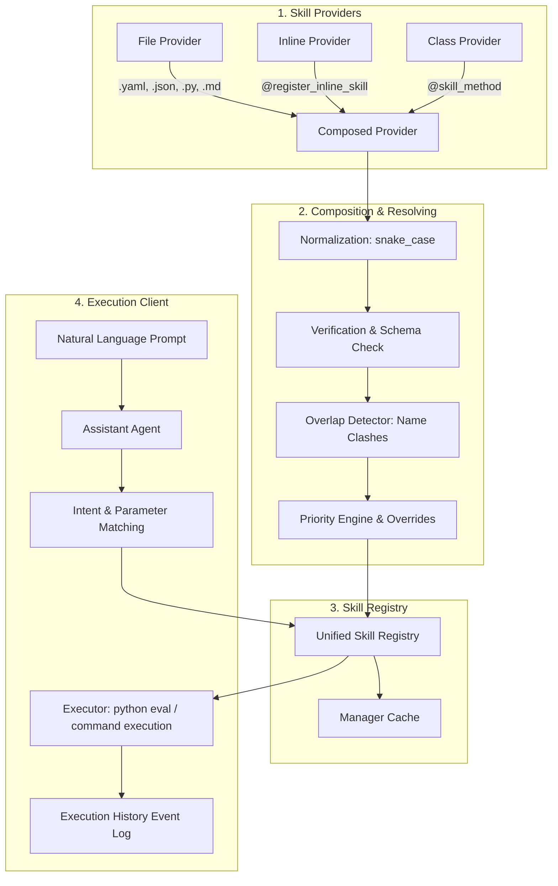

# Multi-Source Skills Provider: System Architecture

This document describes the design, system flow, and integration architecture of the Multi-Source Skills Provider.

## Aim & Overview
The system allows an AI Agent to dynamically acquire capabilities (skills) from multiple independent sources at runtime while maintaining a single, unified type-safe execution interface.

### Key Benefits
- **Decoupled Infrastructure**: Tool configurations are separated from agent logic.
- **Pluggable Architecture**: New skill sources (e.g. MCP servers, external HTTP APIs) can be added by implementing the `BaseProvider` interface.
- **Deterministic Resolution**: Name collisions are resolved deterministically based on priority settings and configuration overrides.
- **Type Safety**: Parameters are validated against JSON schema specs prior to execution.

---

## High-Level Workflow Block Diagram

---

## Detailed Component Specifications

### 1. Data Model (`models/skill.py`)
Each capability is represented by the `Skill` model:
- `name`: Normalized unique string.
- `description`: Function explanation.
- `parameters`: JSON Schema representation of inputs.
- `source_type`: 'file', 'inline', or 'class'.
- `source_path`: Original location file path or class string.
- `version`: Version number (e.g., `1.2.0`).
- `priority`: Evaluated priority level.
- `handler`: Excluded python executable function.

### 2. Resolution Strategy (`resolver/`)
- **Overlap Detection**: Discovers duplicate normalized skill names across different providers.
- **Priority Resolution**: Evaluates global defaults from configuration (`inline` = 100, `class` = 80, `file` = 50).
- **Overrides**: An explicit config override in `configs/priorities.yaml` bypasses priority evaluations to force a desired source winner.

### 3. Execution Pipeline
1. **Dynamic Python Code**: Compiles string statements from YAML/Markdown files inside a dynamic local namespace, extracting callable functions.
2. **Subprocess Execution**: Commands configured in JSON files are executed inside subprocess shells, parameterizing placeholders dynamically.
3. **Class Reflection**: Class methods are automatically inspected and registered, preserving target instance references.
