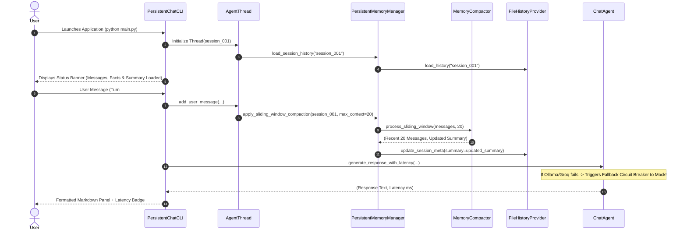

# 📐 System Architecture: Persistent-Memory Chat CLI (Complete Volumes 1-5)

## 1. Executive Summary & Core Concepts

In standard LLM chat applications, conversation history is kept in transient RAM memory. When the application exits or restarts, that memory is completely wiped out.

**Persistent Memory System (Microsoft Agent Framework Pattern)** provides:
1. **Durable File Persistence**: Asynchronous JSONL message logging (`FileHistoryProvider`).
2. **Session Indexing Registry**: Global registry (`history/index.json`) storing custom titles, timestamps, message counts, extracted user facts, and memory summaries for $O(1)$ lookup.
3. **Semantic User Fact Extraction**: Automatic parsing of user statements (Name, Role, Tech Stack, Location, Preferences) with context injection into LLM System Prompts.
4. **Sliding Window Memory Compaction & Summarization**: Automatically compresses older message turns when history exceeds context boundaries into a concise memory summary block, preventing token overflow while preserving deep historical memory (`MemoryCompactor`).
5. **Provider Fallback Circuit Breaker**: Auto-detects network dropouts or missing remote API keys and seamlessly routes execution to the local offline Mock engine without application crashes (`ChatAgent`).
6. **Token Analytics Engine**: Detailed token usage metrics, user vs assistant token ratio, average tokens per turn, and total disk storage footprint (`AnalyticsEngine`).
7. **Multi-Format History Exporter**: Export session histories into TXT, Markdown (`.md`), or structured JSON (`.json`) files.
8. **Production Deployment & Packaging**: Fully dockerized container setup (`Dockerfile` & `docker-compose.yml`) with persistent volume bindings for `./history` and `./logs`.

```
┌────────────────────────────────────────────────────────────────────────────────────────┐
│                        COMPLETE PERSISTENT MEMORY ARCHITECTURE                         │
└────────────────────────────────────────────────────────────────────────────────────────┘

  User Turn ──► [Rich CLI Layout] ──► [AgentThread] ──► [MemoryCompactor]
                      │                  │                    │
                      ▼                  ▼                    ▼
             [Latency Tracker]  [Sliding Window]     [Persistent Summary]
                      │                  │                    │
                      ▼                  ▼                    ▼
               [Fallback CB] ◄── [FileHistoryProvider] ◄─ [index.json Registry]
              (Auto-Routing)      (JSONL Storage)       (Facts & Summaries)
                      │                  │                    │
                      ▼                  ▼                    ▼
               Formatted Output     Multi-Format Export    Token Statistics
               Panel + Latency      (TXT, MD, JSON)        Metrics
```

---

## 2. Component Design & Responsibilities (Volumes 1 - 5)

### 2.1 Component Overview Table

| Component | Class Name | File | Responsibility |
| :--- | :--- | :--- | :--- |
| **CLI Renderer** | `PersistentChatCLI` | [`app/cli.py`](file:///home/cherry/Desktop/1_Gen/Tasks/MAF/Persistance%20Memory/app/cli.py) | Double-border status header panel, input loop, response panels with latency badges. |
| **Command Dispatcher** | `CommandDispatcher` | [`app/commands.py`](file:///home/cherry/Desktop/1_Gen/Tasks/MAF/Persistance%20Memory/app/commands.py) | Handles `/help`, `/history [role]`, `/facts`, `/search`, `/stats`, `/analytics`, `/title`, `/compact`, `/session`, `/clear`, `/model`, `/export [txt\|md\|json]`, `/exit`. |
| **Memory Compactor** | `MemoryCompactor` | [`app/compaction.py`](file:///home/cherry/Desktop/1_Gen/Tasks/MAF/Persistance%20Memory/app/compaction.py) | Compresses older overflow messages into a persistent memory summary block. |
| **Analytics Engine** | `AnalyticsEngine` | [`app/analytics.py`](file:///home/cherry/Desktop/1_Gen/Tasks/MAF/Persistance%20Memory/app/analytics.py) | Calculates token metrics, turn averages, fact density, disk size, and system dashboard. |
| **Agent Thread** | `AgentThread` | [`app/thread.py`](file:///home/cherry/Desktop/1_Gen/Tasks/MAF/Persistance%20Memory/app/thread.py) | Manages session state, system instructions, memory fact injection, persistent summary, and context sliding window. |
| **Memory Manager** | `PersistentMemoryManager` | [`app/memory.py`](file:///home/cherry/Desktop/1_Gen/Tasks/MAF/Persistance%20Memory/app/memory.py) | Facade interface for persistent history storage, fact extraction, searching, compaction, and summarization. |
| **History Provider** | `FileHistoryProvider` | [`app/history.py`](file:///home/cherry/Desktop/1_Gen/Tasks/MAF/Persistance%20Memory/app/history.py) | Atomic JSONL file reader/writer (`history/<session_id>.jsonl`) + Index Manager (`history/index.json`) + Exporter. |
| **AI Agent** | `ChatAgent` | [`app/agent.py`](file:///home/cherry/Desktop/1_Gen/Tasks/MAF/Persistance%20Memory/app/agent.py) | Integrates LLM backends (Local Mock Engine, Ollama, Groq, Gemini) with Fallback Circuit Breaker & latency tracking. |
| **Demo Runner** | `run_demo` | [`demo.py`](file:///home/cherry/Desktop/1_Gen/Tasks/MAF/Persistance%20Memory/demo.py) | Automated end-to-end multi-turn persistent recall verification & portfolio showcase. |

---

## 3. Storage & Analytics Schemas

### 3.1 Session Index Metadata with Memory Summary (`history/index.json`)
```json
{
  "session_001": {
    "id": "session_001",
    "title": "Project Architecture Discussion",
    "created_at": "2026-08-04T17:40:00",
    "updated_at": "2026-08-04T18:00:00",
    "message_count": 24,
    "facts": {
      "name": "Alice",
      "role": "Lead AI Engineer",
      "tech_stack": "Python, PyTorch, Docker"
    },
    "summary": "Past Conversation Summary:\n[USER]: Discussed architecture goals.\n[ASSISTANT]: Recommended FileHistoryProvider pattern."
  }
}
```

---

## 4. Execution Sequence Diagram



---

## 5. Laptop Efficiency & Production Reliability

1. **Zero External Database Overhead**: Append-only JSONL storage eliminates SQL database setup and vector DB memory usage.
2. **Offline Local Engine**: Built-in smart mock provider requires 0 GPU RAM, 0 API keys, and 0 network connection.
3. **Fallback Circuit Breaker**: Prevents application crashes if remote LLMs fail or timeout.
4. **Sliding Context & Summarization**: Bounded context size (`MAX_CONTEXT_MESSAGES=20`) prevents memory growth while preserving long-term conversation summaries.
5. **Fast Metadata Lookup**: Session index registry (`history/index.json`) enables instant $O(1)$ session listing and metadata retrieval.
