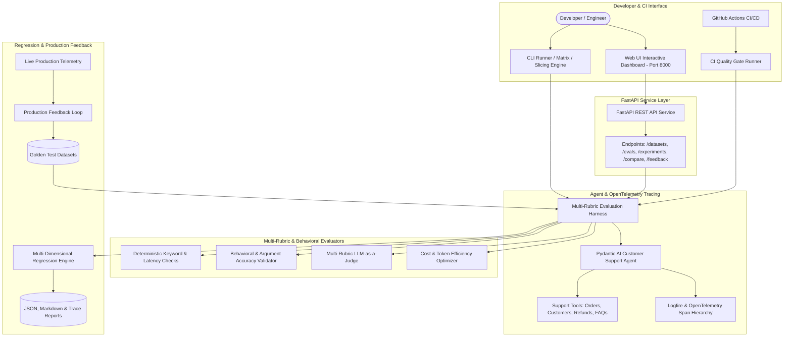

# AgentEval Lab — Complete System Architecture (Volumes 1–5)

## End-to-End Enterprise AI Evaluation Architecture

---

## 5-Volume Engineering Framework Summary

| Volume | Focus Domain | Key Capabilities |
| :--- | :--- | :--- |
| **Volume 1** | Evaluation Foundations | Local test harness, Pydantic AI Support Agent, deterministic evaluators, initial quality gate CLI. |
| **Volume 2** | Evaluation Intelligence | 28 curated cases, multi-rubric LLM judge (Accuracy, Relevance, Policy, Tone), hybrid scoring, metadata slicing. |
| **Volume 3** | Observability & Dashboard | Logfire OpenTelemetry span trees, terminal dashboard, ASCII quality trends, side-by-side comparison, trace debugger. |
| **Volume 4** | Regression Engine & QA | 5-dimensional regression detection (zero-tolerance safety), automated CI/CD PR gate, behavioral evaluators, incident ingestion. |
| **Volume 5** | Expert Production Platform | FastAPI REST service, Interactive Web UI SPA, Model $\times$ Prompt Matrix Runner, token & cost optimizer. |
